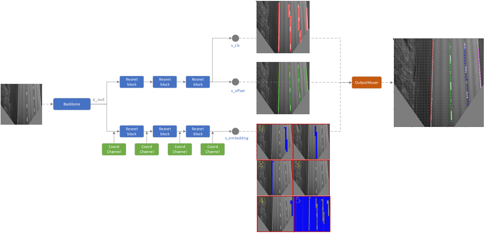

# Lane Detector Fork for SmartRollerz DHBW - Lane Detection on Coral Edge TPU

Hello,
this repository is part of the bigger DHBW Smart Rollerz project (https://dhbw-smartrollerz.org/). We work on a autonmous model car for a interdisciplinary university competition. 

Ben Schlauch and Alwin Zomotor try to bring Edge TPU Lane Detection with this architecture to our car. 

## Contents
- [Lane Detector implementation in Keras](#lane-detector-implementation-in-keras)
  - [Contents](#contents)
  - [Overview](#overview)
  - [Dependencies](#dependencies)
  - [How to use it](#how-to-use-it)
    - [Training](#training)
    - [TF-Lite model convertion](#tf-lite-model-convertion)
    - [Test the model](#test-the-model)
    - [TF-lite Hexagon Delegate test (Snapdragon 835/Hexagon 682)](#tf-lite-hexagon-delegate-test-snapdragon-835hexagon-682)
    - [TODO](#todo)
    - [References](#references)

## Overview
- Create a model for multi-lane detctor that runs on Coral Edge TPU
- Use CVAT or TUSimple labeled images for training
- Uses Birdseyeview
- Over 40 FPS on coral tpu inncluding postprocessing on CPU

<b>The main network architecture</b>:
 

- The input of model is perspective image, and the outputs are anchor offset, class prob and instance data called embeddings
- We split the input image as multiple anchors (n x n):
  - Each anchor responsible for data precting only if lane cross to it.
  - Predcited data would be offset of x, class prob and embeddings.
  - Each lane will have unique embedding index in one image for instance segmentation. see [link](https://arxiv.org/abs/1708.02551) for more details about  embeddings.

- Our model is created by:
  -  resnet block based model as backbone
  -  3 branchs as raw output for training:
     - <b>x_cls</b> : Class probability at each anchor that the lane or background.
     - <b>x_offsets</b> :  Offsets at each anchor (only x offset be cared)
     - <b>x_embeddings</b> : embedding data for instance segmentation.
  - <b>OutputMuxer</b> : A data muxter to mux raw outputs.

## Dependencies
- Tensorflow 2.4.0-dev20200815
- numpy
- opencv-python
- matplotlib

## How to use it

### Training
1. Dataset Creation: @Alwin please explain. We want to generate a train, validation and test set. 
2. Modify the element <b>TuSimple_dataset_path</b> at config.json by your environment,
3. run <b>train_tflite.py</b> for training

        > python3 train_tflite.py

### TF-Lite model convertion and Edge TPU Compiler
Once the training finish, we must convert model as TF-Lite model for mobile platform. Please run <b>generate_tflite_model.py</b> to convert model, the converted model is named same as element <b>"tflite_model_name"</b> at config.json.

    > python3 generate_tflite_model.py

Once the TFlite model is created, we need to use the edge tpu compiler to generate a model compatibel with the Coral. Please note you need to set the experimental and undocumented "a" flag because of the subgraphs 

    > edgetpu_compiler -a [modelpath...]

### Test the model
<b>test_tflite_model.py</b> is used to load and test converted tf-lite at previous step, this program will inference tf-lite model and rendering the result of inferencing.

    > python3 test_tflite_model.py

There is also a file to test the edge tpu model

Postprocessing looks like this:
 

### Final results
On our proprietary dataset, our latest model for the Edge Tpu performed with XXX. 

### TODO
-..........

### References
- Please check out the original repository. https://github.com/ML-Cai/LaneDetector
- We wrote a 80 page very detailed documentation of our project and also in depth about this architecture and our optimizations and struggles. For more information, please message me. 

